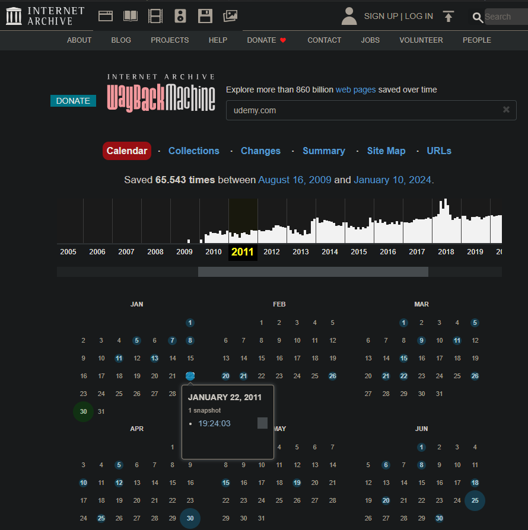
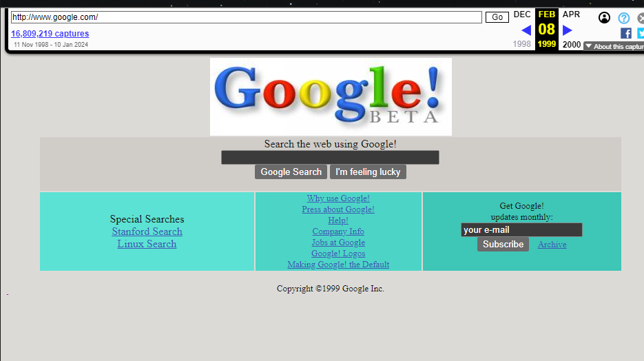
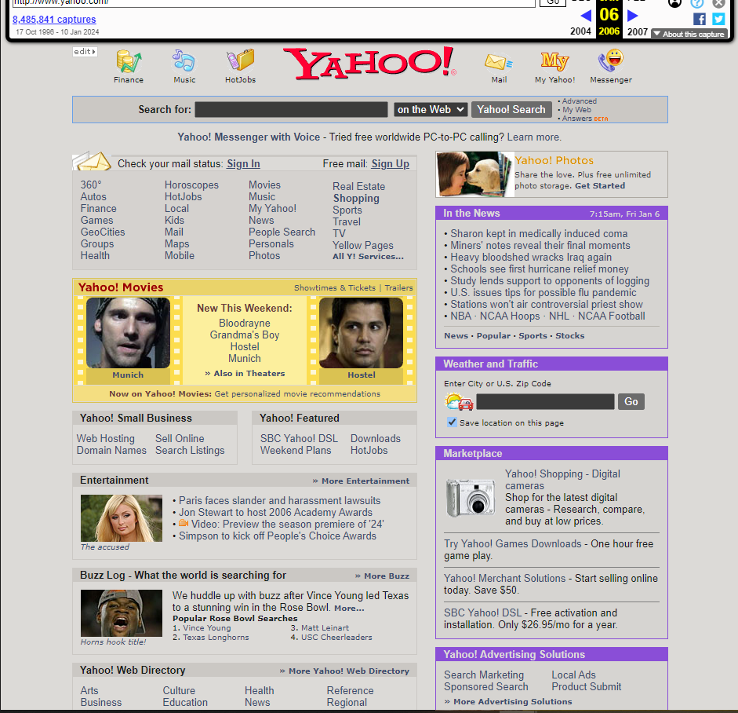
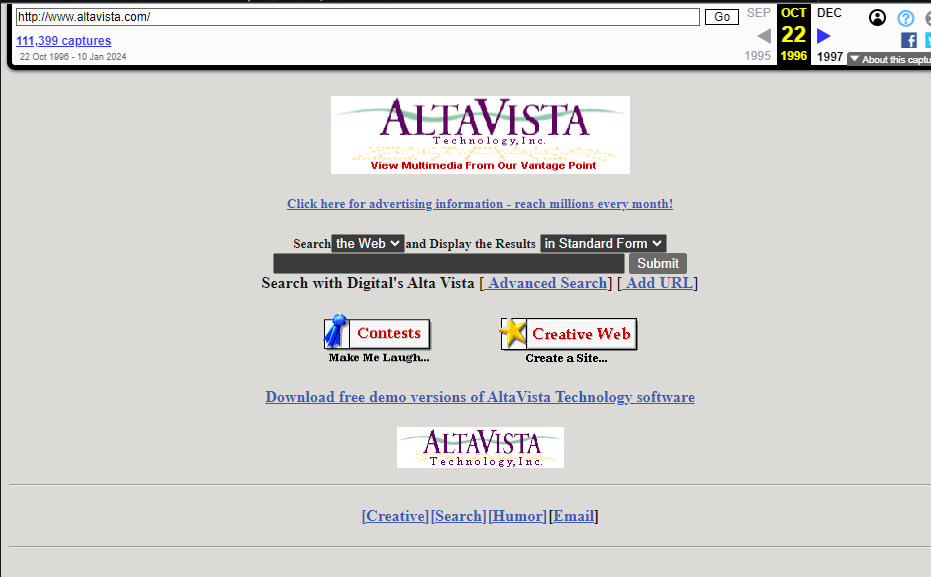
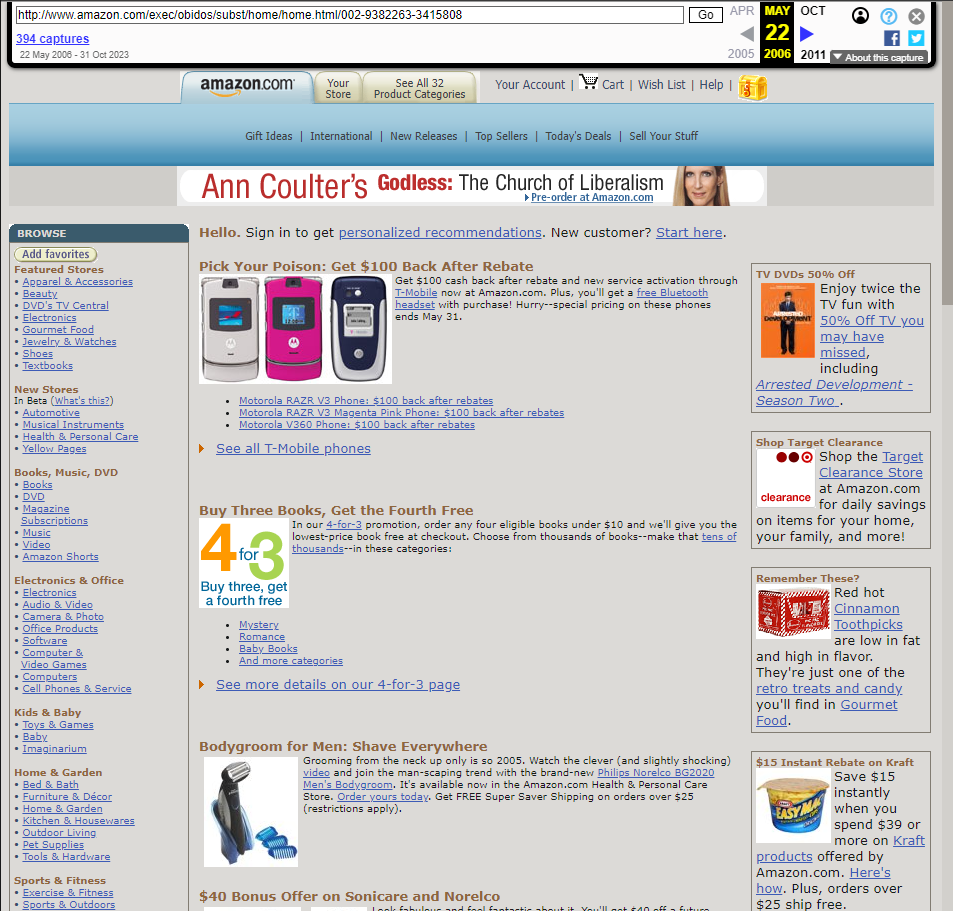
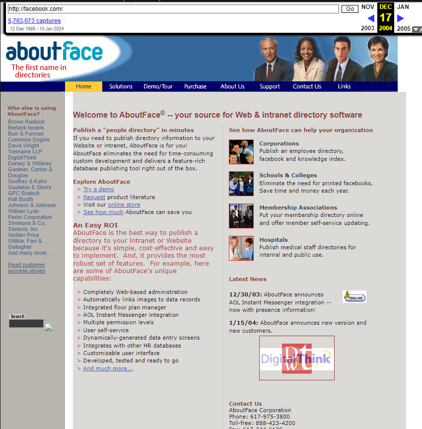
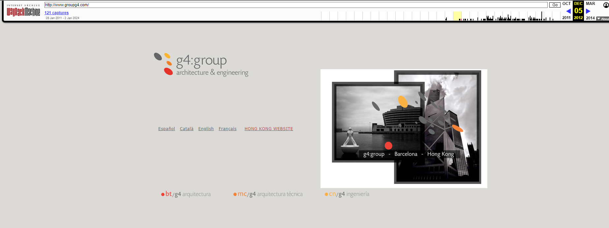
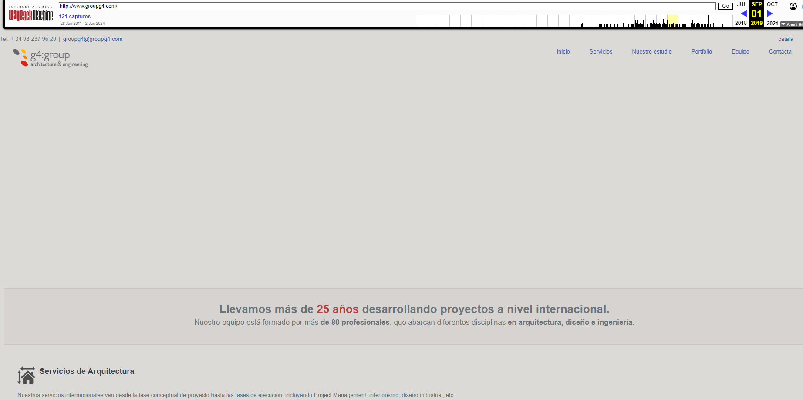

# Cyber2k24

# Archive [](https://awesome.re)

Archive [Más información de Archive](https://web.archive.org/).

<p align="center">
  <br />
  <strong><a href="https://web.archive.org/">Archive</a></strong>
</p>

Nos permite ver todos los Snapshots que tiene una página web hasta la fecha actual `Archive`, nos permite recuperar el contenido del Snapshot de alguna fecha en concreto.

---


### **Table of Contents**

- [Archive](#Archive)
- [Ejemplos](#Ejemplos)

---


## Archive

### Archive [🔎 &#x2192;](https://www.kali.org/tools/Archive/)

```
Archive
```

## Ejemplos

<div align="center"><figcaption>Google</figcaption></div>

<div align="center"><figcaption>Yahoo</figcaption></div>

<div align="center"><figcaption>Altavista</figcaption></div>

<div align="center"><figcaption>Amazon</figcaption></div>

<div align="center"><figcaption>Facebook</figcaption></div>

<div align="center"><figcaption>GroupG4</figcaption></div>

<div align="center"><figcaption>GroupG4</figcaption></div>