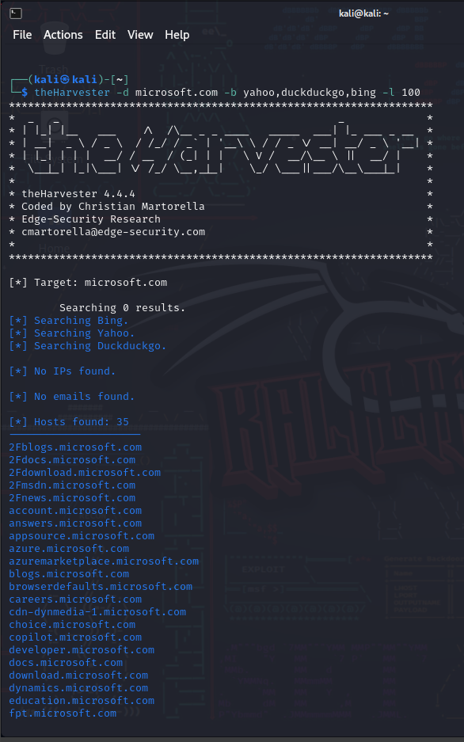

# Cyber2k24

# TheHarvester [](https://awesome.re)

TheHarvester [Más información de TheHarvester](https://www.osintux.org/documentacion/the-harvester/).

<p align="center">
  <br />
  <strong><a href="https://www.osintux.org/documentacion/the-harvester">TheHarvester</a></strong>
</p>

`The Harvester` es una herramienta para la obtención de información en fuentes abiertas. Para ello, utiliza métodos pasivos para, de esta manera, conseguir la información que estamos buscando sin interactuar directamente con el objetivo final (dominio, persona, etc…) a través de los diferentes motores de los principales buscadores y servicios utilizados, o si lo preferimos de forma activa haciendo fuerza bruta, resoluciones inversas, etc…

---


### **Table of Contents**

- [TheHarvester](#TheHarvester)
- [Ejemplos](#Ejemplos)

---


## TheHarvester

### TheHarvester [🔎 &#x2192;](https://www.kali.org/tools/TheHarvester/)

```
TheHarvester
```

## Ejemplos

# ⚠️ En construcción todavía ⚠️