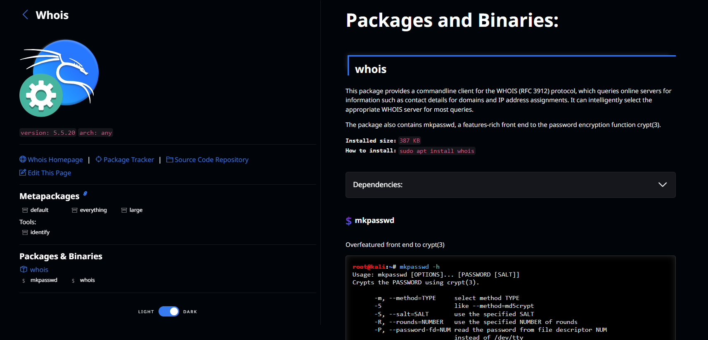
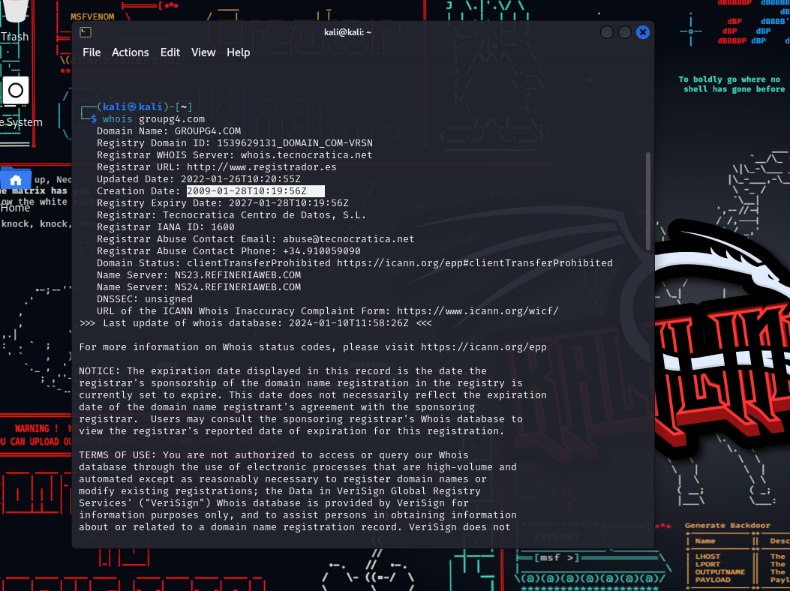

# Cyber2k24

# Whois [](https://awesome.re)

[Más información de Whois](https://www.kali.org/tools/whois/).

<p align="center">
  <br />
  <strong><a href="https://www.kali.org/tools/whois/">Whois</a></strong>
</p>


Se abre la consola de Kali y pondremos `whois`.


El protocolo `whois` facilita un sistema de consulta y respuesta, permitiendo la exploración de bases de datos que contienen información sobre los usuarios registrados asociados a recursos de Internet. Estos recursos pueden ser nombres de dominio o direcciones IP. Además, `whois` se puede emplear para tareas de gestión más avanzadas, extendiendo su utilidad más allá de simples consultas de registro.

---


### **Table of Contents**

- [Whois](#whois)

---


## Whois

```
whois
```

<div align="center"></div>

---

Ejemplo con `Groupg4`

<div align="center"></div>

Realizando la consulta Whois podemos obtener una serie de datos pasivamente de cualquier parámetro que le indiquemos, en este caso estamos realizando una consulta del dominio __groupg4.com__.

Pero la información no es muy precisa ya que hay privacidad de por medio.