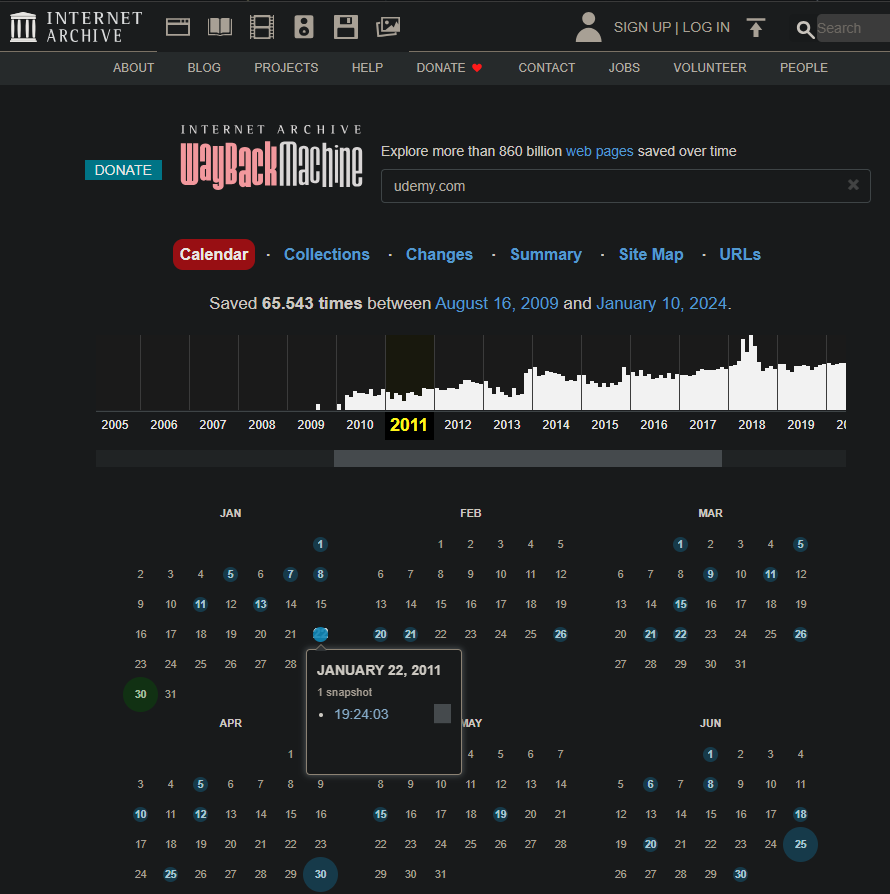
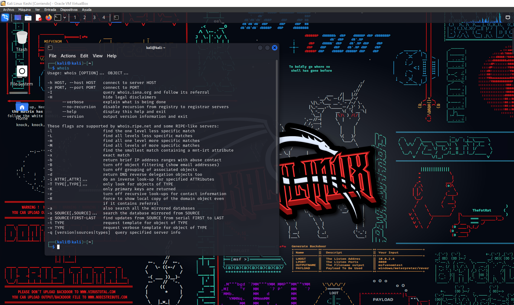

# Cyber2k24

# Archive [](https://awesome.re)

Archive [Más información de Archive](https://web.archive.org/).

<p align="center">
  <br />
  <strong><a href="https://web.archive.org/">Archive</a></strong>
</p>

Nos permite ver todos los Snapshots que tiene una página web hasta la fecha actual `Archive`, nos permite recuperar el contenido del Snapshot de alguna fecha en concreto.

---


### **Table of Contents**

- [Archive](#Archive)

---


## Archive

### Archive [🔎 &#x2192;](https://www.kali.org/tools/Archive/)

```
Archive
```

<div align="center"></div>

<div align="center"></div>

Realizando la consulta Archive podemos obtener una serie de datos pasivamente de cualquier parámetro que le indiquemos, en este caso estamos realizando una consulta del dominio __groupg4.com__.

Pero la información no es muy precisa ya que hay privacidad.
