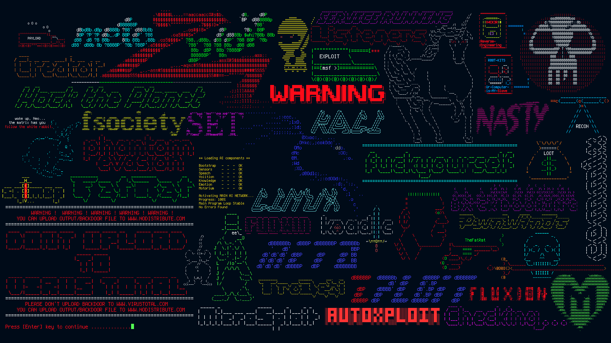
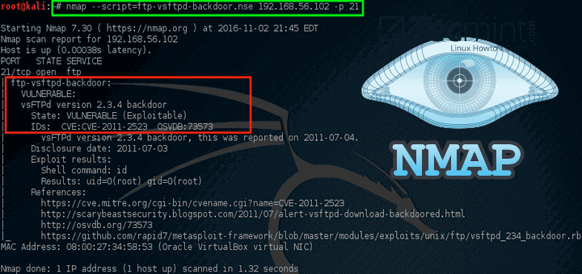

# Cyber2k24

## Aaron Keshi 03.01.24

#### Documentación realizada a partir del curso de www.udemy.com - Cyberseguridad

---

### **Índice**

- [1. Recopilación Pasiva de Información](https://github.com/KeshiKiD03/Cyber2k24/tree/main/1.%20Recopilación%20Pasiva%20de%20Información)
- [Curiosidades Cyber](#curiosidades-cyber)

---

---

### Curiosidades Cyber

    
    
Cómo detectar Vulnerabilidades con Nmap / <i>Haga click en la imagen</i>

#### Créditos: Aaron @Keshi

#### ⚠️ Under construction ⚠️