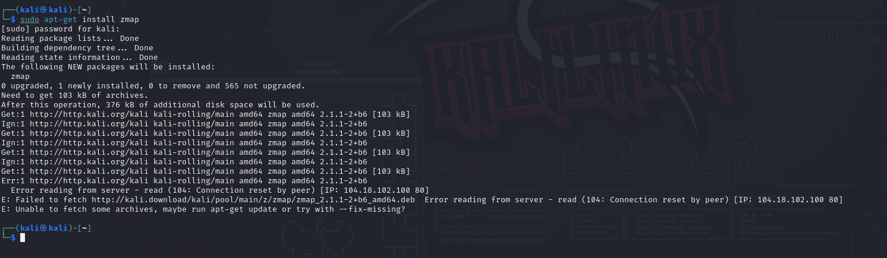

# Cyber2k24

## Aaron Keshi 03.01.24

# Recopilación pasiva de información

* site:udemy.com ficheros pdf 

    * Pertenerecerá a Udemy cada búsqueda.

* site:udemy.com filetype:pdf

    * Mostrar únicamente el tipo de fichero que pertenecen al Dominio Udemy.com y que además el resultado sea un .PDF.

### Google Dorks

* https://www.exploit-db.com/google-hacking-database 

* filetype:sql "MySQL dump" (pass|password|passwd|pwd)

    * Google ha indexado buscando dumps de MySQL para buscar las passwords.

### SQL Injection

* inurl:index.php?id=

###  Exposición de información sensible

* site:gov filetype:pdf allintitle:restricted
* inurl:https://trello.com AND intext:@gmail.com AND intext:password

## Google Hacking: Comandos y Operadores Booleanos

#### A continuación se muestran los comandos principales que podemos utilizar con Google. Hay que tener en cuenta que todos ellos deben ir seguidos (sin espacios) de la consulta que quiere realizarse:

* define:término - Se muestran definiciones procedentes de páginas web para el término buscado.

* filetype:término - Las búsquedas se restringen a páginas cuyos nombres acaben en el término especificado. Sobretodo se utiliza para determinar la extensión de los ficheros requeridos. Nota: el comando ext:término se usa de manera equivalente.

* site:sitio/dominio - Los resultados se restringen a los contenidos en el sitio o dominio especificado. Muy útil para realizar búsquedas en sitios que no tienen buscadores internos propios.

* link:url - Muestra páginas que apuntan a la definida por dicha url. La cantidad (y calidad) de los enlaces a una página determina su relevancia para los buscadores. Nota: sólo presenta aquellas páginas con pagerank 5 o más.

* cache:url - Se mostrará la versión de la página definida por url que Google tiene en su memoria, es decir, la copia que hizo el robot de Google la última vez que pasó por dicha página.

* info:url - Google presentará información sobre la página web que corresponde con la url.

* related:url - Google mostrará páginas similares a la que especifica la url.  Nota: Es difícil entender que tipo de relación tiene en cuenta Google para mostrar dichas páginas. Muchas veces carece de utilidad.

* allinanchor:términos - Google restringe las búsquedas a aquellas páginas apuntadas por enlaces donde el texto contiene los términos buscados.

* inanchor:término - Las búsquedas se restringen a aquellas apuntadas por enlaces donde el texto contiene el término especificado. A diferencia de allinanchor se puede combinar con la búsqueda habitual.

* allintext:términos - Se restringen las búsquedas a los resultados que contienen los términos en el texto de la página.

* intext:término - Restringe los resultados a aquellos textos que contienen término en el texto. A diferencia de allintext se puede combinar con la búsqueda habitual de términos.

* allinurl:términos - Sólo se presentan los resultados que contienen los términos buscados en la url.

* inurl:término - Los resultados se restringen a aquellos que contienen término en la url. A diferencia de allinurl se puede combinar con la búsqueda habitual de términos.

* allintitle:términos - Restringe los resultados a aquellos que contienen los términos en el título.

* intitle:término - Restringe los resultados a aquellos documentos que contienen término en el título. A diferencia de allintitle se puede combinar con la búsqueda habitual de términos.

#### Operadores Booleanos Google Hacking

Google hace uso de los operadores booleanos para realizar búsquedas combinadas de varios términos. Esos operadores son una serie de símbolos que Google reconoce y modifican la búsqueda realizada:

* " " - Busca las palabras exactas.

* - - Excluye una palabra de la búsqueda. (Ej: gmail -hotmail, busca páginas en las que aparezca la palabra gmail y no aparezca la palabra hotmail)

* OR (ó |) - Busca páginas que contengan un término u otro.

* + - Permite incluir palabras que Google por defecto no tiene en cuenta al ser muy comunes (en español: "de", "el", "la".....). También se usa para que Google distinga acentos, diéresis y la letra ñ, que normalmente son elementos que no distingue.

* - Comodín. Utilizado para sustituir una palabra. Suele combinarse con el operador de literalidad (" ").

## ZMAP

ZMap es un escáner de red rápido de paquete único diseñado para estudios de red en Internet. En una computadora de escritorio típica con una conexión Gigabit Ethernet, ZMap es capaz de escanear todo el espacio de direcciones IPv4 públicas en un solo puerto en menos de 45 minutos. Con una conexión de 10 gigE y PF_RING, ZMap puede escanear el espacio de direcciones IPv4 en menos de 5 minutos.

ZMap opera en GNU/Linux, Mac OS y BSD. Actualmente, ZMap tiene módulos de sonda completamente implementados para escaneos TCP SYN, ICMP, consultas DNS, UPnP, BACNET y puede enviar una gran cantidad de sondas UDP. Si está buscando realizar escaneos más complicados (por ejemplo, captura de pancartas o protocolo de enlace TLS), eche un vistazo a ZGrab 2, el proyecto hermano de ZMap que realiza protocolos de enlace con estado en la capa de aplicación.

   
  <strong><a href="https://github.com/zmap/zmap">Github Zmap</a></strong>

## 